# Thyroid Cancer Recurrence Classification with XGBoost

[](https://www.python.org/)
[](https://xgboost.readthedocs.io/)
[](XGBoost_Thyroid_Classification.ipynb)
[](LICENSE)

This project classifies thyroid cancer recurrence using XGBoost with
Information Gain feature selection and grid search. It includes raw data audit,
preprocessing, exploratory analysis, K-Fold Cross Validation, model tuning,
default-model comparison, prediction export, and classification plotting.

The main focus is the recurrence classification task. XGBoost is the modeling
method, while Information Gain supports feature-selection experiments inside
the cross-validation workflow.

## Project Highlights

This project demonstrates:

- Binary classification for recurrence (`Recurred`: `No` / `Yes`).
- Exact duplicate-row removal and missing-row removal before modeling.
- Explicit feature-role encoding for numeric, binary, ordinal, and nominal
  variables.
- K-Fold Cross Validation for model evaluation.
- Fold-wise Information Gain feature selection reused across grid-search
  combinations, with selection frequency reported across folds.
- Cached fold arrays so repeated hyperparameter combinations do not rebuild the
  same model inputs.
- Configuration-aware checkpointing that archives incompatible progress
  instead of mixing results from different experiments.
- XGBoost classifier with configurable hyperparameter search.
- Configurable XGBoost compute device: `auto`, `cpu`, or `gpu`.
- Accuracy as the default grid-search selection metric.
- Accuracy, precision, recall, specificity, F1-score, MCC, ROC-AUC, PR-AUC,
  and Brier score as evaluation metrics.
- Default XGBoost and full grid-search evaluation for every configured
  Information Gain feature count.
- Out-of-fold prediction export and confusion-matrix visualization.

## Workflow Alignment

The notebook follows a compact analytical workflow aligned with common
industry process models:

- [CRISP-DM from IBM](https://www.ibm.com/docs/en/spss-modeler/saas?topic=dm-crisp-help-overview):
  data understanding, data preparation, modeling, evaluation, and deployment
  planning.
- [SEMMA from SAS](https://documentation.sas.com/doc/en/emref/15.3/n061bzurmej4j3n1jnj8bbjjm1a2.htm):
  sample, explore, modify, model, and assess.
- [Modern ML lifecycle guidance from Microsoft/Azure Databricks](https://learn.microsoft.com/en-us/azure/databricks/machine-learning/concepts/ml-lifecycle):
  data preparation, feature processing, model training, evaluation, and
  reproducibility artifacts.

For this repository, raw data audit, preprocessing, validation, and EDA are
kept as separate stages. The notebook first checks the raw dataset, fixes the
identified data-quality issues, validates the cleaned result, and then analyzes
the validated data before feature selection and XGBoost classification. The
repository is intended as a reproducible classification workflow, not a
production clinical decision system.

## Files

| File | Description |
|---|---|
| `XGBoost_Thyroid_Classification.ipynb` | Step-by-step notebook version of the workflow |
| `train_xgboost_thyroid_classification.py` | Python backend for preprocessing, Information Gain, modeling, evaluation, and output generation |
| `Thyroid_Diff.csv` | Classification dataset used by default |
| `requirements.txt` | Python dependencies, including CuPy and its CUDA Toolkit components for optional NVIDIA/CUDA GPU mode |
| `LICENSE` | MIT License for the project code |

Generated output folders, Python caches, and notebook checkpoints are ignored
by Git.

## Notebook and Python Script Roles

The notebook is the main file to read and run. It is organized like a research
workflow: configure the experiment, inspect the raw data, prepare features and
target labels, validate the cleaned modeling data, run EDA, set up K-Fold validation, rank
features with Information Gain, train and compare models, inspect predictions,
and export the outputs.

The Python script acts as the backend for reusable functions. It keeps data
loading, feature selection, encoding, model fitting, evaluation, plotting, and
output writing consistent without making the notebook too crowded. For normal
experiments, change the configuration cell in the notebook first; edit the
script only when changing the underlying workflow logic.

## Data Availability

The included CSV is the Differentiated Thyroid Cancer Recurrence dataset from
the UCI Machine Learning Repository. The dataset contains clinicopathologic
features for recurrence prediction in well differentiated thyroid cancer.

Source:

- Borzooei, S. & Tarokhian, A. (2023). Differentiated Thyroid Cancer Recurrence
  [Dataset]. UCI Machine Learning Repository.
  [https://doi.org/10.24432/C5632J](https://doi.org/10.24432/C5632J)
- Dataset page:
  [https://archive.ics.uci.edu/dataset/915/differentiated+thyroid+cancer+recurrence](https://archive.ics.uci.edu/dataset/915/differentiated+thyroid+cancer+recurrence)
- License: Creative Commons Attribution 4.0 International (CC BY 4.0).

By default, the notebook uses:

```python
data=Path("Thyroid_Diff.csv")
```

To run another dataset with the same structure, place the CSV file in the
project folder and update the notebook configuration cell:

```python
data=Path("your_classification_data.csv")
```

## Data Dictionary

The default dataset contains one numeric feature, several categorical clinical
features, and one target column.

| Column | Role |
|---|---|
| `Age` | Input feature |
| `Gender` | Input feature |
| `Smoking` | Input feature |
| `Hx Smoking` | Input feature |
| `Hx Radiothreapy` | Input feature |
| `Thyroid Function` | Input feature |
| `Physical Examination` | Input feature |
| `Adenopathy` | Input feature |
| `Pathology` | Input feature |
| `Focality` | Input feature |
| `Risk` | Input feature |
| `T` | Input feature |
| `N` | Input feature |
| `M` | Input feature |
| `Stage` | Input feature |
| `Response` | Input feature |
| `Recurred` | Target label |

The default positive class is:

```text
Recurred = Yes
```

## Experiment Scope

The repository is set up as a runnable reference experiment, not as a locked
one-off report. The default run uses the included dataset, plain K-Fold Cross
Validation, Information Gain feature selection, and the configured XGBoost
hyperparameter grid.

The setup keeps the project reproducible while still leaving room to test
reasonable alternatives.

### Configurable from the Notebook

Open the notebook and edit the configuration cell near the top:

```python
args = Namespace(
    data=Path("Thyroid_Diff.csv"),
    target_col="Recurred",
    exclude_features=[],
    cv_splits=10,
    positive_class="Yes",
    selection_metric="accuracy",
    ig_top_k=["all", 10, 11, 12, 13, 14, 15, 16, 17, 18, 19, 20],
    colsample_bytree=[0.6, 0.7, 0.8, 0.9, 1.0],
    learning_rates=[0.01, 0.05, 0.1, 0.2, 0.3],
    max_depths=[4, 5, 6, 7, 8],
    n_estimators=[100, 200, 300, 400, 500],
    subsamples=[0.6, 0.7, 0.8, 0.9, 1.0],
    seed=42,
    device="cpu",
    tree_method="exact",
    n_jobs=-1,
    search_workers=-1,
    base_score=0.5,
    gamma=None,
    min_child_weight=None,
    reg_alpha=None,
    reg_lambda=None,
    scale_pos_weight=None,
    max_bin=None,
    run_name="notebook_xgboost_classification_checkpoint",
    progress_every=500,
    verbose=1,
    output_dir=Path("outputs"),
    keep_runs=1,
    show_plot=False,
    prepare_only=False,
)
```

The configuration is separated into practical experiment controls:

| Group | Settings | Purpose |
|---|---|---|
| Data setup | `data`, `target_col`, `positive_class`, `exclude_features` | Select the CSV file, target setup, and optional feature exclusions. |
| Validation and feature selection | `cv_splits`, `selection_metric`, `ig_top_k` | Control K-Fold evaluation, the model-selection metric, and Information Gain feature-count experiments. |
| Grid-search hyperparameters | `colsample_bytree`, `learning_rates`, `max_depths`, `n_estimators`, `subsamples` | Define the XGBoost classification settings tested across combinations. |
| Manual-check settings | `tree_method`, `base_score`, `gamma`, `min_child_weight`, `reg_alpha`, `reg_lambda`, `scale_pos_weight`, `max_bin` | Keep split construction, initial prediction, class weighting, and regularization choices explicit when comparing with a manual calculation. |
| Reproducibility, compute, and resume | `seed`, `device`, `n_jobs`, `search_workers`, `run_name`, `progress_every` | Control repeatability, CPU/GPU selection, parallel search, checkpointing, and progress output. |
| Output controls | `verbose`, `output_dir`, `keep_runs`, `show_plot`, `prepare_only` | Control progress messages, output location, retained runs, interactive plots, and preparation-only execution. |
| Plot settings | Local `plot_cfg = Namespace(...)` or `settings=Namespace(...)` inside plotting cells | Keep each plot's size, DPI, line width, and grid setting close to the plot it affects. |

### XGBoost Hyperparameters and Manual-Check Notes

The tuned XGBoost hyperparameters in this project are `colsample_bytree`, `learning_rate`, `max_depth`, `n_estimators`, and `subsample`. The notebook also tests different Information Gain top-k feature counts. The notebook names `learning_rates`, `max_depths`, and `subsamples` are plural because each one stores the values tested by the grid search.

| Setting | Library or workflow meaning | Manual-check relevance |
|---|---|---|
| `ig_top_k` | Number of encoded features selected from the entropy-based Information Gain ranking. | Connects directly to the manual Information Gain calculation and feature-count experiment. |
| `tree_method` | XGBoost tree-construction method such as `exact`, `approx`, or `hist`. | Directly affects how candidate splits are searched. Use `exact` for small manual split-gain checks. |
| Fixed objective | The workflow uses `binary:logistic` for the binary recurrence target. | Defines the gradient and hessian behavior used by boosting, but it is not treated as a notebook experiment control. |
| `base_score` | Initial prediction before trees are added. | Important for manual first-step calculations. |
| `learning_rates` | XGBoost `learning_rate`, also called eta. | Shrinks each tree's contribution. |
| `max_depths` | XGBoost `max_depth`. | Limits tree depth and therefore the number of split levels. |
| `n_estimators` | Number of boosting trees. | Controls how many sequential trees are added. |
| `subsamples` | XGBoost `subsample`. | Row sampling ratio for each tree. |
| `colsample_bytree` | Column sampling ratio for each tree. | Controls how many features are available to a tree. |
| `gamma`, `min_child_weight`, `reg_alpha`, `reg_lambda`, `scale_pos_weight`, `max_bin` | Optional split, class-weighting, and regularization settings outside the grid. | Keep as `None` to use XGBoost defaults, or set explicit values to match a manual experiment. |

The notebook reference configuration uses CPU, `tree_method="exact"`, and `base_score=0.5` because those settings are easier to compare with a small manual XGBoost calculation. If `device="gpu"`, use `tree_method="hist"` because modern XGBoost GPU training does not support `exact`.

The experiment runs in two stages. First, default XGBoost evaluates the 12 configured `ig_top_k` choices using 10-fold validation, requiring 120 fits. Second, all 3,125 hyperparameter combinations are evaluated for all 12 feature setups. This requires 37,500 grid combinations or 375,000 fold fits. Ten final fits generate the selected IG and grid-search model's out-of-fold predictions, bringing the complete run to 375,130 model fits.

`search_workers=-1` uses every logical CPU thread in CPU mode and automatically
resolves to one worker in GPU mode. Available CPU threads are divided across
active fits, while final single-model evaluations use `n_jobs=-1`. Fold-specific
feature selections and model arrays are built once and reused. This preserves
the four required ablation setups without nested thread oversubscription or GPU
memory contention.

Each completed combination is flushed immediately to `grid_search_progress.csv` through one open progress stream, avoiding repeated file-open overhead while preserving per-combination resume progress. `grid_search_checkpoint.json` stores a signature of the encoded data, backend code, cross-validation settings, seed, grid, fixed XGBoost settings, device, tree method, and relevant library versions. A matching run resumes; an incompatible checkpoint is moved to a timestamped archive inside the run folder before a new search begins.

### Core Workflow Choices

These parts define the current workflow. They can still be changed, but doing so changes the experiment design and usually belongs in the Python functions, not only in the notebook configuration cell:

- Model family: `XGBClassifier`.
- Validation strategy: plain K-Fold Cross Validation.
- Feature selection method: entropy-based Information Gain.
- Main selection metric: accuracy by default, configurable from the notebook.
- Supporting metrics: precision, recall, specificity, F1-score, MCC, ROC-AUC,
  PR-AUC, and Brier score.
- Feature encoding: numeric passthrough, binary mapping, ordinal mapping, and one-hot encoding for nominal features.
- Missing-value handling: rows with missing values are removed before modeling.
- Feature-count screen: default XGBoost evaluated for every configured `ig_top_k` option.
- Tuned comparison: the full grid evaluated for all features and every configured numeric top-k.

In short, the notebook configuration cell is meant for dataset, validation, Information Gain feature-count experiments, device, tree method, grid-search experiments, and manual-calculation settings. Plot appearance is kept inside each plotting cell. Deeper changes such as a different feature-selection method, encoding rule, model family, or metric formula belong in `train_xgboost_thyroid_classification.py`.


## Compute Device

The notebook reference setting is CPU with
`tree_method="exact"` because it is easier to compare with small manual
tree-building checks. The command-line script also defaults to CPU, while
`tree_method="auto"` leaves the tree-building method to XGBoost unless it is
set explicitly.

```python
device = "cpu"         # "auto", "cpu", or "gpu"
tree_method = "exact"  # "auto", "exact", "approx", or "hist"
```

Recommended settings:

| Setting | Behavior |
|---|---|
| `device="auto"`, `tree_method="auto"` | Uses the public XGBoost defaults |
| `device="cpu"` | Forces CPU execution |
| `device="cpu"`, `tree_method="exact"` | Useful for manual tree-building checks on small data |
| `device="gpu"`, `tree_method="hist"` | Uses XGBoost's CUDA backend with CuPy arrays for model fit and predict |

GPU mode requires an NVIDIA CUDA-capable environment. Feature encoding and
Information Gain preparation still run on CPU, while XGBoost model fit and
predict use CuPy GPU arrays when `device="gpu"` is selected. The notebook prints
a compute runtime report before training so the selected mode and array backend
are visible.

The single requirements file uses `cupy-cuda12x[ctk]` so CuPy has the CUDA
runtime and header components needed by GPU prediction. After pulling this
revision, rerun `pip install -r requirements.txt` before selecting GPU mode.
CUDA runs use `tree_method="hist"`; `search_workers=-1` automatically resolves
to one GPU worker. Feature encoding and fold-wise Information Gain remain CPU
work.

GPU mode is optional, not an automatic speed guarantee. The classification
search fits a very large number of small models, so a parallel CPU search can
outperform sequential CUDA fits despite slower individual tree construction.
Cached modeling arrays use `float32` and the included dataset fits comfortably
in RAM. External-memory or disk-backed training would add unnecessary I/O.

## Workflow

1. Define the workflow configuration and selected dataset.
2. Load the selected classification dataset.
3. Audit the raw dataset to inspect shape, duplicates, missing values, data
   types, unique values, and target balance.
4. Remove exact duplicate rows by keeping the first occurrence.
5. Remove rows with missing values.
6. Encode the target label.
7. Assign each input feature to a numeric, binary, ordinal, or nominal role.
8. Encode the input features into the modeling table.
9. Place the encoded target after all encoded input features and validate the
   modeling table.
10. Run EDA on target distribution, numeric features, categorical features, and
    encoded feature scale.
11. Build K-Fold folds and inspect class distribution per fold.
12. Evaluate every feature count with fold-wise Information Gain and default XGBoost.
13. Run grid search for all features and every configured numeric feature count.
14. Compare default and tuned XGBoost results.
15. Export out-of-fold predictions and class probabilities.
16. Save the confusion matrix, selected-feature frequency, metrics, and run metadata.

```mermaid
flowchart LR
    A["CSV classification data"] --> B["Raw data audit"]
    B --> C["Drop duplicates and missing rows"]
    C --> D["Target and feature-role preparation"]
    D --> E["Encoded modeling table"]
    E --> F["Cleaned data validation"]
    F --> G["Exploratory data analysis"]
    G --> H["K-Fold setup"]
    H --> I["Information Gain selection"]
    I --> J["XGBoost grid search"]
    J --> K["Default and tuned comparison"]
    K --> L["Metrics, out-of-fold CSV outputs, and plots"]
```



## Exploratory Data Analysis

The notebook separates raw-data checks, validation, and EDA so each stage has a
clear purpose.

The raw data audit shows:

- Row count and column count.
- Duplicate row count.
- Missing-value count.
- Target class counts.
- Data type per column.
- Unique-value count per column.

The EDA section then shows:

- Target class distribution table and bar chart.
- Numeric feature summary for `Age`.
- Categorical feature summary for clinical variables.
- Dominant value per categorical feature.

These outputs help identify class imbalance, high-cardinality features, and
features that may need availability checks. They do not automatically decide
the final model, grid, or selected feature count.

## Preprocessing Notes

- Exact duplicate rows are removed with `keep="first"`.
- Rows with missing values are removed before modeling.
- The target column is label-encoded before modeling.
- Numeric features are kept numeric.
- Binary features are mapped to `0/1`.
- Ordinal clinical features use explicit ordered mappings.
- Nominal categorical features are one-hot encoded before model training using
  the explicit category list from the dataset.
- Information Gain feature selection is fitted from each fold's training data,
  not globally before cross-validation.

Feature-role handling:

| Role | Features | Encoding |
|---|---|---|
| Numeric | `Age` | Numeric passthrough |
| Binary | `Gender`, `Smoking`, `Hx Smoking`, `Hx Radiothreapy`, `Focality` | Manual `0/1` mapping |
| Ordinal | `Risk`, `T`, `N`, `M`, `Stage`, `Response` | Manual ordered mapping |
| Nominal | `Thyroid Function`, `Physical Examination`, `Adenopathy`, `Pathology` | One-hot encoding |

The role choices are based on both the dataset values and clinical/statistical
meaning:

- `T`, `N`, `M`, and `Stage` are treated as ordered cancer staging variables.
  The National Cancer Institute describes TNM values and stage numbers as
  increasing with tumor extent, lymph-node involvement, metastasis, or cancer
  advancement.
- `Risk` and `Response` are treated as ordered clinical summary variables based
  on the 2015 American Thyroid Association differentiated thyroid cancer
  guideline. `Response` may also be tested as a nominal feature in a sensitivity
  run when the project avoids imposing clinical order.
- Binary fields such as `Smoking`, `Hx Smoking`, and `Focality` are mapped to
  `0/1` because they have two observed states.
- Multi-category fields without a safe monotonic order, such as `Pathology` and
  `Physical Examination`, are handled with one-hot encoding.

Relevant references:

- National Cancer Institute, [Cancer Staging](https://www.cancer.gov/about-cancer/diagnosis-staging/staging)
- Haugen et al. (2016), [2015 American Thyroid Association Management Guidelines](https://www.liebertpub.com/doi/10.1089/thy.2015.0020)
- scikit-learn, [LabelEncoder](https://scikit-learn.org/stable/modules/generated/sklearn.preprocessing.LabelEncoder.html), [OrdinalEncoder](https://scikit-learn.org/stable/modules/generated/sklearn.preprocessing.OrdinalEncoder.html), and [OneHotEncoder](https://scikit-learn.org/stable/modules/generated/sklearn.preprocessing.OneHotEncoder.html)

## Model Input

The target variable is:

```text
Recurred
```

All columns except the target and any manually excluded columns are treated as
input features. By default, `exclude_features=[]`, so all available features are
used.

Clinical summary variables such as `Response`, `Risk`, and `Stage` may not be
available at every intended prediction time. If the project goal is early
prediction, review these features carefully and run sensitivity checks such as:

```python
exclude_features=["Response"]
```

## Information Gain and Hyperparameter Search

Information Gain is implemented with the classic entropy formula:

```text
IG(Y, X) = H(Y) - H(Y | X)
```

The target entropy `H(Y)` is computed from the recurrence label distribution.
The conditional entropy `H(Y | X)` is computed by grouping the target labels by
each encoded feature value. Numeric features such as `Age` are grouped by their
observed numeric values, binary and ordinal features use their explicit mapped
values, and nominal features are ranked through their one-hot dummy columns.
This makes `ig_top_k` refer to the number of encoded features selected for
XGBoost.

The feature-count screening choices and tuned hyperparameter grid are:

```python
ig_top_k = ["all", 10, 11, 12, 13, 14, 15, 16, 17, 18, 19, 20]
learning_rates = [0.01, 0.05, 0.1, 0.2, 0.3]
max_depths = [4, 5, 6, 7, 8]
n_estimators = [100, 200, 300, 400, 500]
subsamples = [0.6, 0.7, 0.8, 0.9, 1.0]
colsample_bytree = [0.6, 0.7, 0.8, 0.9, 1.0]
```

The encoded feature table is prepared before model training. Information Gain
ranking is computed from each K-Fold training split and reused across
hyperparameter combinations for the same fold. Each split learns its selected
encoded features only from that split's training data.

The `"all"` option keeps all encoded features. The integer options test whether
10 to 20 Information Gain-selected encoded features can match or improve the
full 32-feature setup.

Default XGBoost and the full hyperparameter grid evaluate `"all"` and every
configured numeric top-k. Information Gain is calculated once for each fold's
training subset, then the cached ranking is reused for every feature count and
hyperparameter combination in that fold. The best default and tuned numeric
top-k results are selected independently by mean accuracy, then F1-score,
PR-AUC, ROC-AUC, and the smaller feature count.

The grid-search output reports accuracy, precision, recall, specificity,
F1-score, MCC, ROC-AUC, PR-AUC, and Brier score for every completed
combination. A separate summary keeps the best hyperparameter combination for
each tuned feature setup.

Selection uses full-precision fold metrics. Rounding to four decimals is
applied only when tables are displayed or exported. Every cross-validation
summary uses the arithmetic mean of the fold-level evaluation metrics; pooled
out-of-fold predictions are retained for row-level exports and the confusion
matrix.

The final visible comparison contains four aligned setups: default XGBoost
with all encoded features, tuned XGBoost with all features, default XGBoost
with its best numeric top-k, and tuned XGBoost with its independently selected
best numeric top-k.

The fixed XGBoost hyperparameters outside the grid search are applied consistently
to every grid-search combination and to the default comparison model.

## Metrics

The default grid-search selection metric is accuracy. Accuracy is used to pick
the best grid-search result because this experiment compares the overall
classification rate across Information Gain feature counts and XGBoost
hyperparameters.

Precision, recall, specificity, F1-score, MCC, ROC-AUC, PR-AUC, and Brier score
are also reported for tuned and default models. These supporting metrics are
important because accuracy can look high when one class dominates.

Higher values are better except for Brier score, where lower values indicate
better probability predictions.

## Result Interpretation

- Higher accuracy indicates a larger share of correctly classified samples.
- Accuracy can look high when the majority class dominates, so it is
  interpreted together with the supporting metrics.
- Precision reports the share of predicted recurrence cases that were actually
  recurrence cases.
- Recall reports the share of actual recurrence cases detected by the model.
- Specificity is derived from the confusion matrix and reports the share of
  non-recurrence cases correctly identified by the model.
- F1-score balances precision and recall for the recurrence class.
- MCC summarizes all four cells of the binary confusion matrix.
- ROC-AUC summarizes ranking quality from predicted class probabilities.
- PR-AUC summarizes the precision-recall trade-off for the recurrence class.
- Brier score measures probability error; lower values are better.
- Information Gain and XGBoost results are interpreted as model/data
  diagnostics, not medical conclusions.

## Post-Processing

Predicted class labels and class probabilities are exported as produced by the
cross-validated model workflow. No probability calibration or threshold tuning
is applied by default. The reported labels therefore follow XGBoost's standard
classification decision rule for the fitted model.

## Limitations

- Plain K-Fold does not force each fold to keep the same class proportion, so
  class distribution is inspected in the notebook output.
- The dataset has 383 rows, so results can be sensitive to fold assignment and
  random seed.
- Some clinical summary features may not be available at the intended
  prediction time. Run sensitivity checks with `exclude_features` when needed.
- Information Gain captures statistical association with the target, not causal
  importance.
- Hyperparameters and feature counts are selected and reported from the same
  non-nested K-Fold procedure. The CV results are suitable for internal model
  comparison but can be optimistic as an independent generalization estimate.
- The workflow is suitable for portfolio and reproducible experimentation, not
  clinical deployment.

## Installation

Python 3.12 is recommended. The code requires Python 3.10 or newer.

```powershell
pip install -r requirements.txt
```

## Usage

Run the notebook:

```text
XGBoost_Thyroid_Classification.ipynb
```

Check the data flow without training:

```powershell
python train_xgboost_thyroid_classification.py --prepare-only
```

Run the full checkpointed grid search:

```powershell
python train_xgboost_thyroid_classification.py
```

For a resumable command-line run, use a fixed run name:

```powershell
python train_xgboost_thyroid_classification.py --run-name xgboost_classification_checkpoint
```

Run a smaller functional check:

```powershell
python train_xgboost_thyroid_classification.py --ig-top-k 5 --learning-rates 0.1 --max-depths 4 --n-estimators 100 --subsamples 1.0 --colsample-bytree 1.0 --cv-splits 3
```

Use every logical CPU thread for independent feature-count and grid tasks:

```powershell
python train_xgboost_thyroid_classification.py --device cpu --search-workers -1
```

Force CPU execution:

```powershell
python train_xgboost_thyroid_classification.py --device cpu
```

Run with NVIDIA GPU acceleration:

```powershell
python train_xgboost_thyroid_classification.py --device gpu --tree-method hist --search-workers 1
```

## Reproducibility and Runtime

- The notebook and script default to the included CSV dataset.
- K-Fold uses `shuffle=True`; the configured `seed` is passed to
  scikit-learn's `random_state` for reproducible fold assignment.
- XGBoost also receives the same random state for reproducible model fitting.
- `search_workers` changes scheduling, not the combinations or metric formulas.
  Parallel CPU search divides logical threads across active fits to avoid
  nested oversubscription without leaving cores idle.
- Both notebook and command-line reference runs default to CPU. Set
  `device="auto"` or `device="gpu"` explicitly when that behavior is required.
- GPU mode requires `tree_method="hist"` and an NVIDIA CUDA-capable setup.
- Full grid search can take a long time because the default grid is broad.
- `grid_search_progress.csv` preserves completed combinations for resume runs.
- `grid_search_checkpoint.json` prevents progress produced by a different
  experiment configuration from being silently reused.
- Use `--prepare-only` to verify data loading and preprocessing without model
  training.
- Use the smaller functional-check command above before running the full grid.

## Outputs

Each completed run creates an output folder under `outputs/`. By default, only
the latest completed run folder is kept.

Main output files:

| File | Description |
|---|---|
| `feature_encoding_roles.csv` | Numeric, binary, ordinal, and nominal feature roles |
| `encoded_classification_dataset.csv` | Encoded features in source-column order, followed by the encoded target in the final column |
| `encoded_feature_encoding_roles.csv` | Mapping from original features to encoded feature columns |
| `classification_main_summary.csv` | Four requested setups with accuracy, precision, recall, specificity, and F1-score |
| `classification_supporting_summary.csv` | MCC, ROC-AUC, PR-AUC, Brier score, and model setup for the same four setups |
| `grid_search_progress.csv` | Checkpoint file containing every completed grid-search combination |
| `grid_search_checkpoint.json` | Signature and configuration used to validate resumable progress |
| `grid_search_results.csv` | Full grid-search result table with all reported classification metrics |
| `best_grid_search_parameters.csv` | Final selected Information Gain feature count and XGBoost hyperparameters |
| `default_vs_grid_search_by_feature_count.csv` | Default and tuned results for every configured feature setup |
| `best_cv_predictions.csv` | Out-of-fold actual labels, predicted labels, fold numbers, and class probabilities |
| `best_selected_features_by_fold.csv` | Encoded features selected by Information Gain in each fold for the best configuration |
| `best_selected_feature_frequency.csv` | Frequency of each selected encoded feature across folds |
| `best_fold_metrics.csv` | Fold-level classification and probability metrics for the best configuration |
| `best_confusion_matrix.png` | Confusion matrix for the selected model |
| `run_metadata.json` | Configuration, compute runtime, and selected-feature metadata |

Generated outputs, Python caches, and notebook checkpoints are ignored by Git.

## Authors

- M. Thufail Alwannabil Samas](https://github.com/mthufailsamas) — Code implementation, data processing, and modeling
- [Hana Meidina Qurrota A'yun](https://github.com/hanameidina) — Research documentation and result interpretation

## License

This project is released under the MIT License for the project code. Dataset
redistribution follows the permission or license of the dataset source.
